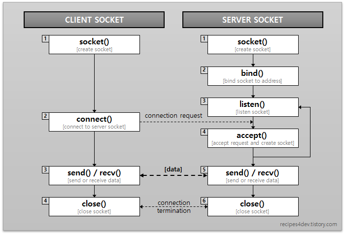

## 레이어드 아키텍쳐란 
- 소프트웨어를 다양한 층으로 나누어 구축하는 설계 패턴.
- 상위 레이어는 하위 레이어의 서비스를 이용할 수 있음.
- 각 레이어가 책임을 가진다.

### 레이어드 아키텍쳐 구조

- 1. Presentation layer - 사용자 인터페이스 (view) , 웹 통신 프레임워크, CLI 등 인터페이스, 입출력의 변환 등 외부와의 통신을 담당.
  2. Business layer - 핵심 비지니스 로직, 비즈니스 로직을 수행하는 것을 주 관심사로 둔다. 마찬가지로 화면에 데이터를 출력하는 방법이나 혹은 데이터를 어디서, 어떻게 가져오는지에 대한 내용은 알고있지 않는다.
  3. Persistence layer - 영속성 컨텍스트가 여기 속하나??, 어플리케이션의 영속성을 구현하기 위해, 데이터 출처와 그 데이터를 가져오고 다루는 것을 주 관심사로 둔다. 대표적인 구성요소는 Repository, DAO 등이 있음.
  4. Database layer - 데이터 소스 직접 다루는 층

- 각 계층은 캡슐화 되어있고, 의존하지 않으며 단일 책임을 가지고 있다.

### 결론

- 소프트웨어의 복잡성을 관리하고 구조를 명확히 하는데 도움을 줌.
- 효과적인 유지보수, 높은 재사용성, 유연한 설계패턴

---
## record 클래스란? 

- ava Record는 bolierplate code를 줄이는 것을 목표로 하는 특별한 형태의 클래스 선언 방법.

### 구조

- public record TestRecord(String name, int age) {} : 일반적인 클래스와 다르게 선언과 함께 필드(컴포넌트)를 나열하여 선언

### 기능

- 상속 불가능 처리 (final class)
- 필드 private final 처리 및 Setter 미구현을 통한 불변성 제공
- Getter 구현
- equals() 구현
  - 일반 클래스는 주소 값을 비교하여 equals() 메서드 동작하지만, record 클래스는 이를 override 하여 모든 필드 값을 비교하도록 되어있음.
- hashCode() 구현
- toString() 구현

### Compact 생성자

- 표준 생성자와는 달리 컴팩트 생성자 내부에서는 인스턴스 필드에 접근할 수 없다는 특징이 있음. 따라서 validation으로 사용 가능.

---

## 스프링 동작 원리

### 스프링이란?

 - 자바 플랫폼을 위한 오픈소스 어플리케이션 프레임워크로, 엔터프라이즈급 어플리케이션을 개발하기 위한 모든 기능을 종합적으로 제공하는 경량화된 솔루션.(대규모 작업에 적합하다는 뜻.)
 - 이때, 다른 프레임워크와 다르게 멀티쓰레드 기반임. 이 말은 동시성 문제를 야기할 수 있다는 뜻.

### 스프링 프레임워크 특징

- IoC (Inversion of Control) : 제어의 역행 - 제어의 역행이라는 뜻으로, 소프트웨어 컴포넌트 간의 의존성 관리를 개선하는 디자인 패턴.
  - 스프링 어노테이션.md @Bean 과 @Component 차이점 보면 쉽게 이해 가능.

- DI (Dependency Injection) : 의존성 주입 - 의존성 객체를 개발자가 생성하지 않고 빈으로 등록해두면 스프링 프레임워크가 알아서 찾아 의존성 주입해줄 수 있음. 이를 통해 모듈간의 결합도를 낮출 수 있다.

- AOP (Aspect Oriented Programming) : 관점 지향 프로그래밍 - 핵심 로직 외의 부가적인 횡단 관심사를 모듈화하는 개념.

- POJO (Plane Old Java Object) : 평범한 자바 객체. 자바의 기본적인 객체 지향 프로그램 원칙을 따름.

### MVC 디자인 패턴

- Model : Model은 애플리케이션의 정보, 데이터의 가공을 책임지며 데이터베이스와 상호작용하여 비즈니스 로직을 처리하는 모듈임.
  - View(뷰) 또는 Controller(컨트롤러)에 대해 어떤 정보도 알 수 없어야 함.(의존성에 관한 것)
  - 모델은 재사용이 가능해야 하며 다른 인터페이스에서도 변하지 않아야 함.

- View : View는 클라이언트 단에서 보여지는 결과화면을 반환하는 모듈임.
  - Model(모델)이나 Controller(컨트롤러)에 대한 정보를 알면 안됨.
  - 데이터를 받아 단순히 화면에 표시해주는 역할만.

- Controller : Controller는 client로부터 request가 들어왔을 때 그 입력을 처리하고 어떤 로직을 실행시킬 것인지 Model(모델)과 View(뷰)를 연결해주며 제어하는 모듈임.
  - 모델이나 뷰의 변경 통지를 받으면 이를 해석해서 각각의 구성 요소에게 통지를 해야함.
  - 애플리케이션의 메인 로직을 담당.
---
## 스프링 컨테이너란 무엇인가. 객체와 관리 DI

### 스프링 컨테이너는 스프링 컨테이너는 스프링 프레임워크의 핵심 컴포넌트이다.
- 스프링 컨테이너는 자바 객체의 생명 주기를 관리하며, 생성된 자바 객체들에게 추가적인 기능을 제공한다. 스프링에서는 자바 객체를 빈(Bean)이라 한다.
  - 즉, 스프링 컨테이너는 내부에 존재하는 빈의 생명주기를 관리(빈의 생성, 관리, 제거 등)하며, 생성된 빈에게 추가적인 기능을 제공하는 것이다.
    

### 스프링 컨테이너의 기능
- 스프링 컨테이너는 빈(Bean)의 인스턴스화, 구성, 전체 생명 주기 및 제거까지 관리함.
  - 스프링 컨테이너를 통해 원하는 만큼 많은 객체를 가질 수 있다.
  - 스프링 컨테이너는 서로 다른 빈을 연결하여 애플리케이션 빈을 연결하는 역할을 한다.

### 스프링 컨테이너 사용하는 이유
- 일반적으로 자바에서 객체 생성하면 -> new 사용 -> 수많은 객체가 서로 참조 -> 객체지향 프로그램과 맞지 않음
- 따라서 객체 의존성을 낮추어 결합도는 낮추고 높은 캡슐화를 위해 스프링 컨테이너가 사용된다.(DI를 하기 때문에 의존성이 낮아짐)
---
## OS

### 멀티쓰레드는 소켓 통신(TCP)과 C언어 코드를 통해 이해했습니다.

서버란 : 클라이언트의 역할을 하는 프로세스와 소켓을 통해 IPC를 수행하는 것

소켓: TCP소켓(=stream), UDP소켓(=datagram)으로 나뉨

[동작과정]

[TCP 소켓을 사용하는 흐름]

<aside>
💡 TCP 소켓의 핵심은 **accept() 시스템 콜**

</aside>

1. socket() 시스템 콜: 소켓을 만드는 시스템 콜, 미리 형태를 잡아두는 것 / 파일 디스크립터 형식으로 반환. 
- 형식: socket(IPV6, stream, 6(=TCP))

---

2. bind() 시스템 콜: 생성한 소켓에 실제 아이피 주소와 포트 번호 매기는 것(클라이언트는 포트 번호 자동 생성) / bind()시스템 콜은 서버에서만 사용

- 형식: bind(sockfd, sockaddr, socklen_t)
  - sockfd: 바인딩 할 소켓의 파일 디스크립터
  - sockaddr: 소켓에 바인딩 할 아이피 주소, 포트번호를 담은 구조체
  - socklen_t: 위 구조체의 메모리 크기

---

3. listen() 시스템 콜: 연결요청을 대기하는 함수 / Only for TCP

- 파라미터로 받은 backlog 크기만큼 backlog queue를 만드는 시스템 콜!(클라이언트 대기실)
  - 형식: listen(sockfd, backlog)

**서버의 listen 이후  Client의 connect() 시스템 콜 요청: SYN 던짐

---

4. accept() 시스템 콜: 연결요청 수락 함수 / 반환값은 새로운 디스크립트 번호 = ***accept() 함수를 통해 새로 할당받은 소켓을 이용해 데이터 송,수신을 할 수 있는 것***

    왜 새로운 소켓 생성? 
    
    SYN 요청을 보낸 클라이언트가 적어도 하나 있어서 백로그 큐에 있었고 해당 클라이언트의 요청에 대한 이후 응답을 위해 **새로운 소켓을 만들었다.**
    
    형식: int accept(sockfd, sockaddr, socklen_t);
    
    이 listen 시스템 콜이 설정된 이후에 클라이언트의 connect() 요청을 받을 수 있는데, 하나 하나 accept() 해주면 병목 발생 → 멀티 프로세스/ 멀티 쓰레드 이용 : **연결 요청을 받는 부분 따로, 이후 응답까지 주는 부분을 따로 나누게 된다.**
    
    멀티프로세스:  컨텍스트 스위칭을 통해 일어남. 부모에 해당하는 프로세스 작업을 이어오다가, 새로운 자식프로세스를 생성하고 싶은 순간 fork() 함수 호출 
    
    i)fork() == 0: 자식 프로세스 / **마지막에 exit(0) 시스템 콜을 호출(=새로운 응답 안받고 그냥 종료)**
    
    ii) fork() ≠ 0 : 부모 프로세스
    
    이 fork() 함수를 통해 병렬처리를 진행할 수 있다.
    
    멀티 쓰레드:  fork()함수 통해 생성. 프로세스 생성하기 부담스럽고, 컨텍스트 스위칭 하는게 멀티프로세스에서보다 빨라서 만들어짐. 자원을 공유하기 때문에 필연적으로**동시화 문제**가 발생할 수 밖에 없다. 교착상태가 발생하지 않도록 주의해야 한다.
    
    **accept() 시스템 콜 이후에 잔여 3-Way-Handshaking 진행: SYN+ACK → ACK ⇒ Established

<aside>
📢 **서버는 연결을 받는 부분과 응답을 주는 부분이 병렬적으로 이루어져 있다**

</aside>)

- 스프링은 멀티쓰레드 기반이라서 동시 요청에 대해 안전하지가 않다. 즉 필드에 객체나 변수가 선언되면 여러 쓰레드가 접근할 수 있다. 노드는 하나의 쓰레드가 순차적으로 처리되지만 스프링은 그렇지 않다.
  컴퓨터가 자원을 읽을 때 현재 상태를 읽고 값을 바꾸는데 멀티스레드 기반에서 동시에 요청이 오면 값의 일관성이 없어진다.

  - 예를 들어 게시글 좋아요가 100개인 상태에서 동시에 2명이 좋아요를 눌렀을 때 102개가 되어야 하지만 101개가 될 수도 있다는 뜻이다 두 쓰레드가 조회 시점에 100을 읽기 때문에 변경된 값이 적용되지 않는다.

---
## CustomException

### 개요
- 개발을 하다 보면 수많은 Exception 을 만남. 이때, Exception 발생하는 부분을 쉽게 알아채고 코드를 수정하기 위해 CustomException 사용.

### 방법
- 총 4가지의 클래스 존재
  1. CustomErrorCode : Exception이 발생하였을때 알려준 Status 상태와 메시지를 담은 enum 클래스
  2. CustomErrorResponse : 일종의 dto
  3. CustomException : RuntimeException을 상속받은 클래스
  4. CustomExceptionHandler : 일종의 Exception Controller
  
---

## Checked exception vs Unchecked exception

### 자바의 예외처리는 크게 3가지로 나눌 수 있다.

- 에러
  - 시스템에 비정상적인 상황이 발생했을 경우에 발생.
  - 메모리 부족(OutofMemoryError)이나 스택오버플로우(StackOverflowError)와 같이 복구할 수 없는 것.

- 체크 예외
  - RuntimeException의 하위 클래스가 아니면서 Exception 클래스의 하위 클래스.
  - ex) 존재하지 않는 파일의 이름을 입력(FileNotFoundException), 실수로 클래스의 이름을 잘못 적음(ClassNotFoundException)
  - 반드시 예외 처리 함.
  - Rollback이 되지 않고, 트랜젝션이 commit까지 완료.
  
- 언체크 예외
  - RuntimeException의 하위 클래스, 실행 중에 발생할 수 있는 에러.
  - ex) 배열의 범위를 벗어난(ArrayIndexOutOfBoundsException), 값이 null이 참조변수를 참조(NullPointerException)
  - 명시적인 예외처리 강제하지 않음.
  - Rollback 함.

---
## 직렬화와 역직렬화 

### 직렬화란?

- 객체들의 데이터를 연속적인 데이터(스트림)로 변형하여 전송 가능한 형태로 만드는 것.

### 역직렬화란? 

- 직렬화된 데이터를 다시 객체의 형태로 만드는 것.
  
더 공부 필요..

---
## [스프링] 싱글톤 방식의 주의점 : 스프링 빈은 항상 무상태로 설계할 것.
- 스프링 빈으로 등록되는 클래스는 공유가 될 수 있는 전역 변수를 사용하면 안된다.
- 싱글톤으로 빈 객체를 유지하는 스프링 컨테이너 특성 상 멤버 변수를 두게 되면 다른 곳에서 그 상태를 유지한 채 재사용 될 수 있음.
  - 서로 다른 요청에 따라 스레드가 각자의 스택 메모리를 차지한다고 해도 힙 영역은 이미 빈 객체가 로딩되어 있음. -> 꼬인다.
- 따라서, 빈 객체는 메서드를 공유하는 역할을 해야하며, 필드 값이 없는 무상태로 설계해야 한다.

---

## SOLID 원칙 

### SOLID 원칙은 객체 지향 설계의 5가지 기본 원칙을 나타내는 약어이다.

1. Single Responsibility Principle(단일 책임 원칙) : 한 클래스는 하나의 책임만 가져야 하는 원칙
2. Open-Closed Principle(개방-폐쇄 원칙) : 소프트웨어 구성요소(클래스, 모듈 등)는 확장에는 열려있어야 하지만 변경에는 닫혀 있어야 한다는 원칙(기존의 코드를 변경하지 않고도 기능을 추가할 수 있어야 함.)
3. Liskov Substitution Principle(리스코프 치환 원칙) : 서브 타입은 언제나 그것의 베이스 타입으로 교체할 수 있어야 한다는 원칙
4. Interface Segregation Principle(인터페이스 분리 원칙) : 자신이 사용하지 않는 인터페이스에는 의존하면 안된다는 원칙
5. Dependency Inversion Principle(의존성 역전 원칙) : 고수준 모듈은 저수준 모듈에 의존해서는 안 되며, 둘 다 추상화에 의존해야 한다는 원칙

* SOLID 개발의 장점
  1. 유지보수 용이
  2. 확장성 높음
  3. 유연한 소프트웨어 만들 수 있음

---

## 스프링과 JSON

### 스프링은 Jackson 라이브러리를 통해 JSON으로 값을 주고 받을 수 있음. 이때 직렬화와 역직렬화 개념이 필요.(JsonAnnyGetter..)

---

## 생성자에 매개변수가 많다면 빌더 패턴을 고려할 것 (이펙티브 자바)

* 생성자와 정적 팩터리 메서드는 매개변수가 많을 때 적절히 대응하기 어렵다는 단점이 있음.

### 점층적 생성자 패턴 (telescoping constructor pattern)

* 필수 매개변수를 받는 생성자 1개, 그리고 선택매개변수를 하나씩 늘여가며 생성자를 만드는 패턴 - 필수 매개변수만 받는 생성자, 필수 매개변수와 선택 매개변수 1개를 받는 생성자, 선택 매개변수를 2개까지 받는 생성자, ... 형태로 선택 매개변수를 전부 다 받는 생성자까지 늘려가는 방식이다.

* 단점:
  1. 초기화하고 싶은 필드만 포함한 생성자가 없다면, 설정하길 원치 않는 필드까지 매개변수에 값을 지정해줘야 한다.
  2. 복잡하고 읽기 어렵다.

* 매개변수가 많아졌을 떄의 문제점이 있음.

### 자바빈 패턴 (JavaBeans pattern)

* 매개변수가 없는 생성자로 객체를 만든 후, setter 메서드를 호출해 원하는 매개변수 값을 설정하는 방식.

* 단점: 
  1. 객체 하나를 만들려면 메서드를 여러 개 호출해야 한다.
  2. 객체가 완성되기 전까지는 일관성이 무너진 상태에 놓이게 된다.

### 빌더 패턴

* Builder를 이용해 필수 매개변수로 객체를 생성하고, 일종의 setter를 사용하여 선택 매개변수를 초기화한 뒤
  build() 메서드를 호출하여 완전한 객체를 생성하는 패턴.

* 클라이언트는 필요한 객체를 직접 만드는 대신, 필수 매개변수 만으로 생성자(혹은 정적 팩터리)를 호출해 빌더 객체를 얻음.

* 점층적 생성자 패턴의 안전성과 자바빈즈 패턴의 가독성을 겸비.

* 빌더 패턴은 객체 생성 선에 setter를 통해 값을 넣기 때문에 불변하고, 또한 안정성이 있다.

---

## Optional

### Optional 이란 
* null이 올 수 있는 값을 감싸는 Wrapper 클래스로, 참조하더라도 NPE가 발생하지 않도록 도와주는 클래스이다.

### 안티패턴이란? 
* 안티패턴은 실제 많이 사용되는 패턴이지만 비효율적이거나 비생산적인 패턴을 의미한다. 안티패턴은 성능, 디버깅, 유지보수, 가독성등에 있어 부정적인 영향을 줄 수 있기 때문에 지양해야하는 패턴이다.

### Optional 안티패턴
* 필드로 사용금지
  * Optional은 Serializable를 구현하지 않기 때문에 필드로 사용하면 안된다.
  
* isPresent()-get() 대신 orElse(), orElseGet(), orElseThrow() 사용하기

* Optional을 생성자나 메서드 파라메터로 사용금지

* orElse() 대신 orElseGet(), orElseThrow() 사용하기

---

## 일반 객체로 선언하는 것과 빈으로 등록하는 것의 차이

1. 생성 및 관리
   - 일반 객체: 개발자가 명시적으로 객체를 생성하고 관리해야 한다. 객체 생성 시 의존성 주입, 라이프사이클 관리, 초기화 및 소멸 작업을 수동으로 처리해야 함.
   - 빈 객체: Spring 컨테이너에 의해 관리. Spring이 빈의 생성, 의존성 주입, 라이프사이클 관리, 초기화 및 소멸 작업을 자동으로 처리한다.

2. 의존성 주입 (Dependency Injection):
   - 일반 객체: 의존성을 직접 코드 내에서 주입해야 함. 
   - 빈 객체: Spring이 자동으로 의존성을 주입. 생성자 주입, 세터 주입, 필드 주입 등 다양한 방식으로 주입할 수 있다.

3. 스코프:
   - 일반 객체: 객체의 스코프를 직접 관리해야 함. (싱글톤, 프로토타입 등)
   - 빈 객체: Spring이 빈의 스코프를 관리한다. 기본적으로 싱글톤 스코프이지만, 다른 스코프(프로토타입, 요청, 세션 등)로 설정할 수 있음.

## 언제 빈으로 등록하는 것이 좋을까 ? 

1. 의존성 주입이 필요한 경우 
2. 객체의 스코프가 중요한 경우

---

## 스코프란 무엇인가

- 스코프는 객체가 생성되고 유지되는 범위를 의미한다.
- 따라서, 빈 스코프는 Spring 컨테이너에서 빈 객체가 어떻게 생성되고 관리되는지를 정의하는 개념임.

### 스프링 빈 스코프의 종류 

1. Singleton (기본값)
   - 정의: Spring 컨테이너 당 한 개의 인스턴스만 생성하여 공유하는 스코프.
   - 특징: 모든 요청에서 동일한 빈 인스턴스를 반환.
   - 사용: 상태를 유지하지 않고, 여러 곳에서 공통으로 사용되는 빈에 적합.
   - 설정: 별도의 설정이 없으면 기본적으로 싱글톤 스코프가 적용.

2. Prototype
   - 정의: 요청할 때마다 새로운 인스턴스를 생성하는 스코프.
   - 특징: 각 요청에서 새로운 빈 인스턴스를 반환.
   - 사용: 상태를 유지해야 하거나, 각 사용자가 독립적인 빈 인스턴스를 필요로 하는 경우에 적합.
   - 설정: @Scope("prototype") 어노테이션을 사용.

3. Request 
   - 정의: HTTP 요청마다 하나의 인스턴스를 생성하고, 요청이 끝나면 소멸되는 스코프.
   - 특징: 웹 애플리케이션에서 각 HTTP 요청마다 빈이 생성되고 소멸.
   - 사용: 요청마다 다른 데이터를 처리해야 하는 경우에 적합.
   - 설정: @Scope("request") 어노테이션을 사용.

### 스코프와 빈의 사용

- 싱글톤 빈은 애플리케이션 전체에서 하나의 인스턴스를 공유하기 때문에 메모리 사용을 줄이고 초기화 비용을 최소화할 수 있음 but 상태를 유지해야 하는 빈에는 적합하지 않다. 
- 프로토타입 빈은 요청마다 새로운 인스턴스를 생성하므로 메모리 사용이 증가할 수 있지만, 상태를 개별적으로 유지할 수 있다.

---

## 싱글톤이란 무엇인가..

* 싱글톤 패턴은 소프트웨어 디자인 패턴 중 하나로, 한 클래스의 인스턴스가 오직 하나만 생성되고, 그 인스턴스에 전역적으로 접근할 수 있도록 하는 패턴.
* 이해 안간다면 => A,B,C 사용자가 똑같은 객체의 이름만 A,B,C로 달아 자기 것을 쓰면 다른 사람들이 자신의 자원을 건들 일이 없지만 A,B,C 사용자가 싱글톤 객체 T 하나만 이용한다면 T의 필드는 이곳저곳에서 건들여 정합성 보장이 되지 않는다.(멘토님 코드리뷰)

## 싱글톤 패턴의 특징
- 유일한 인스턴스: 클래스의 인스턴스가 하나만 존재하도록 보장.
- 전역 접근: 애플리케이션 어디서나 이 인스턴스에 접근할 수 있음.
- 메모리 절약: 객체를 한 번만 생성하므로 메모리를 절약할 수 있다.
- 상태 공유: 애플리케이션의 모든 부분에서 동일한 상태를 공유할 수 있다.

## 싱글톤의 장단점

장점
- 메모리 절약: 객체를 하나만 생성하므로 메모리를 절약할 수 있다.
- 일관된 접근: 모든 클래스에서 동일한 인스턴스에 접근할 수 있어 일관성을 유지할 수 있다.
- 리소스 관리: 데이터베이스 연결이나 설정 파일 등 공유 자원을 관리하기에 적합.

단점
- 테스트 어려움: 싱글톤은 전역 상태를 가지므로 단위 테스트가 어려울 수 있다.(공유하기 때문)
- 의존성 문제: 다른 클래스와 강하게 결합될 수 있음.
- 멀티스레드 이슈: 잘못 구현된 싱글톤은 멀티스레드 환경에서 문제가 발생할 수 있다.(멘토님이 계속 말씀하시던 것)

##  스프링에서 왜 기본 빈 스코프를 싱글톤으로 설정하였을까

- Spring에서 기본 빈 스코프를 싱글톤으로 설정한 것은 성능, 메모리 효율성, 일관성 유지, 설계의 단순화, 전역 상태 관리, 그리고 검증된 디자인 패턴의 장점을 종합적으로 고려한 결과이다.
---
